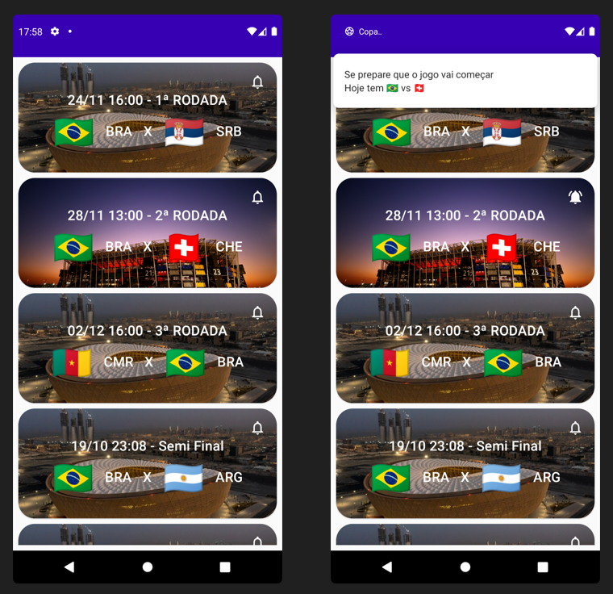

# App Android - Copa 2022

### API

https://digitalinnovationone.github.io/copa-2022-android/api.json

##

### 📄 Descrição:

App Android em Kotlin que mostra as partidas da Copa de 2022 (país que jogará, data, horário e rodada) e notifica o usuário minutos antes de começar (o usuário escolhe sobre qual partida quer ser notificado e recebe uma mensagem alertando sobre o início da partida).

Foi utilizado:

- Arquitetura: Clean Architecture com os 3 módulos padrão -> app | data | domain;
- Jetpack Compose com Hilt;
- Dados salvos localmente com o Datastore;
- Agendamentos de notificações com o WorkManager;
- Tratamento de dados e chamadas de sincronismo com Coroutines;
- Lifecycle Components para gerenciar tudo.

##

### 📲 Layout:

<h1>
  
</h1>
